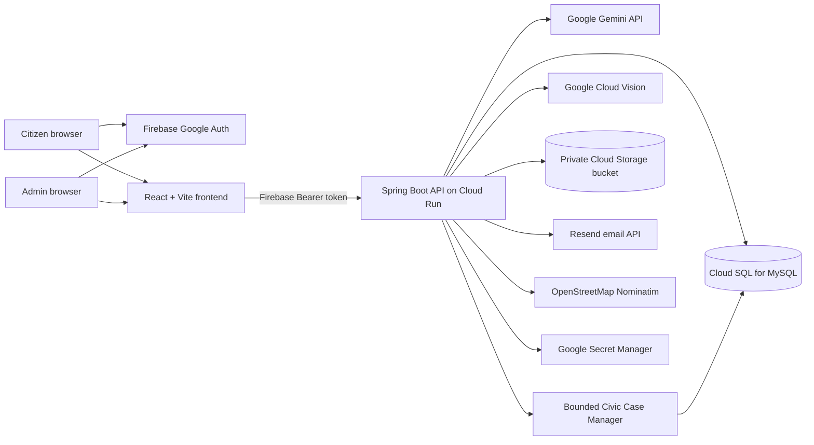

# Community Hero AI

Community Hero AI is a civic collaboration and accountability platform that turns citizen reports into validated, prioritized, and trackable civic cases. Citizens can report infrastructure problems with location and evidence, communities can verify them, AI can prepare resolution guidance, and authorities can manage each case through a transparent workflow.

## Project Links

| Resource | Link |
| --- | --- |
| Live citizen application | https://project-eb406bb8-8a69-4442-937.web.app |
| Live backend API | https://community-hero-backend-740785794030.asia-south1.run.app |
| API documentation | [docs/API.md](docs/API.md) |
| Detailed setup guide | [docs/SETUP.md](docs/SETUP.md) |


## Problem Statement

Citizens often report potholes, leaks, damaged streetlights, waste, and drainage problems through disconnected channels. Reports may lack reliable location data, duplicate an existing complaint, include unrelated evidence, or disappear without a visible resolution trail. Authorities also need a practical way to prioritize cases without hiding the process from the public.

Community Hero AI addresses this by creating one accountable lifecycle:

```text
Citizen report
  -> location and evidence validation
  -> duplicate detection
  -> Gemini civic analysis
  -> bounded Civic Case Manager investigation
  -> community verification
  -> emergency or authority escalation
  -> work in progress
  -> resolution certificate
```

## Key Capabilities

### Citizen Portal

| Capability | Description |
| --- | --- |
| Google sign-in | A single Firebase Google sign-in page identifies citizens and redirects allowlisted administrators automatically. |
| Issue reporting | Citizens submit a title, description, category, reporter details, location, and optional evidence. |
| GPS and address detection | Browser geolocation captures coordinates. Nominatim reverse geocoding fills country, state, district, city, locality, postal code, road, and formatted address. |
| Searchable map pin | Citizens can search a landmark or locality and confirm or move the map pin when device GPS is inaccurate. |
| Photo and video evidence | Citizens can choose files or capture live camera evidence. The system supports up to five images and one short video per issue. |
| Vision validation | Google Cloud Vision checks image labels and objects against the selected civic category before submission. A clear category mismatch blocks submission until corrected. |
| Duplicate warning | Similar unresolved issues with the same category, within 300 meters, and with similar text are shown before a new report is created. |
| AI complaint assistance | Gemini prepares a citizen-facing complaint draft after the report is saved. The report remains available even if AI analysis fails. |
| Community verification | Neighbors can verify an issue and add an optional observation. Three verifications automatically move a report from `REPORTED` to `VERIFIED`. |
| Emergency escalation | Citizens can request urgent authority action. A non-urgent AI assessment produces a warning, but citizens can explicitly override it when they believe immediate danger exists. |
| Public accountability history | Citizens can see official status events, notes, actors, timestamps, and resolution evidence without receiving admin controls. |
| Resolution certificate | A resolved issue receives a printable certificate containing its timeline, resolution summary, evidence, SLA assessment, and ledger verification receipt. |
| Map intelligence | Leaflet displays issue markers, marker clusters, heatmaps, and the user's current position using OpenStreetMap data. |
| Dashboard | Citizens can view issue totals, categories, affected wards, high-impact issues, community verification totals, and ward health scores. |
| Gamification | Citizens earn points and badges for useful reports and community verifications. |
| Citizen help guide | A floating chatbot answers common questions about reporting, location, evidence, duplicates, verification, escalation, statuses, privacy, and points without consuming an AI API quota. |
| Civic Case Manager | A bounded agent gathers trusted case signals and gives citizens a safe summary while reserving operational recommendations for human authority review. |

### Admin Authority Portal

| Capability | Description |
| --- | --- |
| Protected authority desk | Only a Firebase-authenticated email present in the backend `ADMIN_EMAILS` allowlist can use admin APIs. |
| Case queue | Authorities review reported, verified, escalated, and in-progress issues from a focused admin workspace. |
| Internal Gemini analysis | Admins can inspect severity, impact score, department routing, risk assessment, urgency, resolution plan, and escalation guidance. |
| AI regeneration | An administrator can regenerate the Gemini analysis for an existing issue. |
| Evidence moderation | Admins can review validation details and remove inappropriate media. Citizens cannot delete submitted evidence. |
| Status controls | The portal enforces allowed status transitions and requires official notes for authority actions. |
| Resolution evidence | Authorities can add a resolution note and an optional evidence or work-order URL when resolving a case. |
| Authority email | Reviewed complaints can be sent through Resend to a category-specific authority recipient. Every attempt is logged. |
| Integrity verification | Admins can recalculate the HMAC-SHA-256 civic ledger chain and detect direct database tampering. |
| Agent investigation workspace | Admins can inspect persistent tool observations, confidence, proposed status, target window, and approve or reject the recommendation. |

## Supported Issue Categories

- `POTHOLE`
- `WATER_LEAKAGE`
- `STREETLIGHT_DAMAGE`
- `WASTE_MANAGEMENT`
- `DRAINAGE_ISSUE`

## Issue Lifecycle

| Stage | Trigger |
| --- | --- |
| `REPORTED` | A citizen successfully submits a new issue. |
| AI analyzed | Gemini successfully writes structured civic analysis to the issue. This is represented in the visual timeline rather than as a database status. |
| `VERIFIED` | The issue receives at least three community verifications. |
| `ESCALATED` | An authority advances it, or a configured authority email is sent successfully. |
| `IN_PROGRESS` | An administrator records that authority work has started. |
| `RESOLVED` | An administrator submits a resolution note and closes the case. |

Allowed authority transitions are deliberately restricted:

```text
REPORTED -> ESCALATED
VERIFIED -> ESCALATED
ESCALATED -> IN_PROGRESS
IN_PROGRESS -> RESOLVED
```

## AI and Agentic Features

### Gemini Civic Resolution Agent

The backend sends issue context to Google Gemini using title, description, citizen-selected category, ward or locality, coordinates, and available media context. Gemini is instructed to return JSON containing:

- Confirmed category
- Severity: `LOW`, `MEDIUM`, `HIGH`, or `CRITICAL`
- Recommended department
- Impact score from 0 to 100
- Risk explanation
- Suggested next action
- Complaint draft
- Escalation message
- Resolution urgency

The backend saves the basic issue before requesting Gemini analysis. Therefore, a Gemini timeout, invalid response, or exhausted quota never prevents the citizen's report from being stored.

### Dispatch Copilot

The authority portal converts AI analysis into internal routing and prioritization guidance. Operational details remain admin-only, while the citizen sees the complaint draft and public workflow history.

The implemented Civic Case Manager extends this analysis into a persistent, bounded agent workflow. It reuses the saved Gemini assessment and autonomously gathers trusted information through eight controlled steps: case planning, issue context, evidence inspection, duplicate search, ward health analysis, community signal analysis, workflow history review, and recommendation synthesis. Reusing the existing Gemini result prevents an additional Gemini API charge for every investigation.

Each investigation records its trigger, model, confidence, target resolution window, recommended department, priority, proposed status, citizen summary, admin recommendation, and concise tool observations. These observations are operational explanations rather than private model chain-of-thought.

Agent runs are created automatically after a report is analyzed, when evidence is uploaded, and when the third community verification is received. Administrators can also start a fresh investigation manually from the Authority Portal.

Citizens receive only a safe summary, recommended next step, confidence score, and a reminder that official action requires authority approval. Administrators receive the complete activity log, ward and evidence signals, proposed transition, target response window, and `Approve` or `Reject` controls.

The agent cannot directly send email, delete evidence, resolve an issue, or bypass workflow rules. Approval delegates to the existing authority workflow, which validates the proposed transition and records the human actor, review note, timestamp, evidence URL, and ledger event. Rejection is also recorded as an accountable review decision.

The role-safe endpoints are `GET /api/issues/{id}/agent/public-summary` for citizens and the protected `/api/admin/issues/{id}/agent-runs` endpoints for admin investigation, regeneration, approval, and rejection.

### Image Validation

Google Cloud Vision Label Detection and Object Localization inspect uploaded image bytes. The system does not classify an image from its filename. Validation metadata is stored with the evidence so the result remains available on the issue record.

Validation states are:

| State | Meaning |
| --- | --- |
| `VALID` | Visual evidence is consistent with the selected category. |
| `SUSPECT` | The evidence clearly mismatches the category and blocks submission until corrected. |
| `UNAVAILABLE` | Vision could not run; evidence can be queued for manual review. |
| `FAILED` | The provider request failed; the failure is shown without crashing the report flow. |
| `NOT_APPLICABLE` | The attachment is video and is not processed by the image validator. |

## Community Verification and Gamification

Community verification represents independent citizen confirmation, not AI or admin approval. Three verification records attached to one issue make it community verified.

Leaderboard scoring is calculated from civic actions:

| Action | Points |
| --- | ---: |
| Submit a report | 20 |
| Verify another issue | 10 |
| One of the citizen's reports receives three verifications | 25 bonus |

Badges include `First Reporter`, `Neighborhood Watch`, `Community Validator`, `Impact Maker`, and `Civic Champion`.

The leaderboard text has three separate counters. `Reports` means reports created by that contributor. `Verifications` means confirmations that contributor submitted on other reports. `Verified reports` means the contributor's own reports that received at least three community confirmations.

## Duplicate Detection

The duplicate detector intentionally uses understandable, non-ML rules:

- Same issue category
- No more than 300 meters from the candidate issue
- Text similarity across normalized title and description
- Existing unresolved cases are prioritized as active duplicates
- Resolved matches produce a warning that the issue was previously fixed at that location

Citizens can view the existing issue before deciding whether the problem is genuinely new or has returned. Related reports can be grouped in presentation while retaining their individual descriptions and audit history.

## Ward Health Scoring

Each ward starts at 100 points. Unresolved issues subtract points based on severity:

| Severity | Penalty |
| --- | ---: |
| `CRITICAL` | 10 |
| `HIGH` | 6 |
| `MEDIUM` | 3 |
| `LOW` | 1 |

Issues older than seven days receive an additional penalty. Scores are clamped between 0 and 100 and mapped to `HEALTHY`, `MODERATE`, `NEEDS_ATTENTION`, or `CRITICAL`. The dashboard orders lower-scoring wards first so authorities can identify pressure quickly.

## Zero Trust Civil Ledger

Status events and community verification events are appended to `civic_audit_ledger`. Each entry includes the previous entry hash and a keyed HMAC-SHA-256 hash:

```text
current_hash = HMAC-SHA256(server_secret, canonical_event_data + previous_hash)
```

The server-only key is stored in Google Secret Manager. A person with database access cannot silently modify an older event and generate a valid replacement chain without that key. Citizens may see the latest hash as a public verification receipt, but only administrators can run the full integrity scan.

This is tamper-evident logging, not a blockchain. It provides accountability without requiring a public ledger network or cryptocurrency.

Completed agent investigations and human approval or rejection decisions are also appended to this ledger. The ledger records the run identifier, trigger, proposed status, confidence, reviewer, and decision without exposing hidden reasoning or the HMAC secret.

## Architecture



### Technology Stack

| Layer | Technology |
| --- | --- |
| Frontend | React 18, Vite 6, Tailwind CSS, Axios |
| Maps | Leaflet, React Leaflet, OpenStreetMap, Leaflet MarkerCluster, Leaflet Heat |
| Authentication | Firebase Authentication with Google sign-in |
| Backend | Java 21, Spring Boot 3.3, Spring Web, Spring Security, Bean Validation |
| Persistence | Spring Data JPA, MySQL 8, Google Cloud SQL connector |
| AI | Google Gemini through LangChain4j and a bounded multi-tool Civic Case Manager |
| Image intelligence | Google Cloud Vision |
| Media | Private Google Cloud Storage bucket |
| Email | Resend HTTPS API |
| Deployment | Google Cloud Run and Firebase Hosting |
| Secrets | Google Secret Manager |
| Testing | JUnit 5, Spring Boot Test, Mockito |

## Security Model

- Every protected API request carries a Firebase ID token in the `Authorization: Bearer` header.
- Spring Security verifies the token using the Firebase Admin SDK.
- A verified Firebase email receives the citizen role.
- The admin role is granted only when the verified email is present in backend `ADMIN_EMAILS`.
- Frontend role checks control navigation but are never treated as the authorization boundary.
- Admin-only operations include status changes, AI regeneration, authority email preview/send, media deletion, demo seeding, visual fact-check mutation, and ledger integrity checks.
- Agent activity logs and operational recommendations are admin-only; citizens receive a separate sanitized projection.
- Agent proposals require explicit human approval and still pass through backend status-transition validation.
- Cloud Storage objects remain private and are served through controlled backend media routes.
- Database passwords and API credentials are supplied to Cloud Run from Secret Manager.
- `.env` files, generated builds, local media, crash dumps, and dependency folders are excluded from Git.

## Repository Structure

```text
community-hero-ai/
|-- backend/
|   |-- src/main/java/com/communityheroai/
|   |   |-- agent/          # Bounded case orchestration, runs, tools, review APIs
|   |   |-- ai/             # Gemini service, DTOs, and prompts
|   |   |-- demo/           # Optional demo data seeding
|   |   |-- gamification/   # Points, badges, and leaderboard
|   |   |-- issue/          # Civic issue domain and APIs
|   |   |-- ledger/         # Tamper-evident audit chain
|   |   |-- location/       # Search and reverse geocoding
|   |   |-- security/       # Firebase token and role enforcement
|   |   `-- upload/         # Cloud Storage media access
|   |-- src/main/resources/
|   |-- src/test/
|   |-- .env.example
|   |-- Dockerfile
|   `-- pom.xml
|-- frontend/
|   |-- src/pages/          # Citizen and authority pages
|   |-- src/                # App shell, auth, chatbot, maps, camera
|   |-- .env.example
|   |-- firebase.json
|   `-- package.json
|-- docs/
|   |-- API.md
|   `-- SETUP.md
|-- .gitignore
`-- DOCUMENTATION.md
```

## Core Data Model

| Entity | Purpose |
| --- | --- |
| `Issue` | Report details, address, coordinates, AI analysis, status, and timestamps |
| `IssueMedia` | Cloud Storage key, media type, processing state, and Vision validation metadata |
| `IssueVerification` | Citizen verification, optional email/comment, evidence URL, and timestamp |
| `IssueStatusHistory` | Previous and next status, actor, note, evidence URL, and timestamp |
| `IssueEmailLog` | Authority email attempts, recipient, provider response, and delivery status |
| `CivicLedgerEntry` | Immutable event payload, previous hash, HMAC hash, and algorithm |
| `AgentRun` | Investigation trigger, summaries, confidence, proposal, review decision, and timestamps |
| `AgentRunStep` | Ordered tool action and concise observation for an agent investigation |


## Demonstration Flow

1. Sign in with a normal citizen Google account.
2. Open `Report Issue` and search for or capture the exact location.
3. Select a category and attach a matching photo.
4. Demonstrate that an unrelated image is marked `SUSPECT` and blocks submission.
5. Submit the correct report and show duplicate detection before creation.
6. Open the issue and show its AI complaint draft, public timeline, evidence, and map location.
7. Add three community verifications to move it to `VERIFIED`.
8. Request emergency escalation and show the explicit override path for a non-critical AI assessment.
9. Sign in with the configured admin account and open `/admin/authorities`.
10. Open the Civic Case Manager and show its eight-step evidence, duplicate, ward-health, community, and workflow investigation.
11. Review the confidence, target response window, proposed status, and next action.
12. Add a human review note and approve or reject the recommendation. Explain that the agent never executes consequential actions independently.
13. Move the issue from `ESCALATED` to `IN_PROGRESS`, then to `RESOLVED` with a resolution note.
14. Return to the citizen view and show the sanitized agent summary and public status history.
15. Open the public resolution certificate and print or save it as PDF.
16. Run the admin integrity check to show that status, verification, agent-run, and review events are tamper-evident.
17. Finish with dashboard ward health, map clusters and heatmap, leaderboard points, and the citizen help chatbot.

## Reliability and Fallback Behavior

- A report is saved even when Gemini analysis fails.
- AI fields remain unavailable until a later admin regeneration succeeds.
- Poor browser GPS readings above the configured accuracy threshold require manual map confirmation.
- Vision provider failures do not crash the page; they are shown for manual review.
- Missing email configuration queues the escalation for admin review instead of crashing the issue API.
- Duplicate detection warns citizens without silently deleting their description or evidence.
- Cloud Storage is mandatory for persistent production media; Cloud Run's temporary filesystem is not used.
- Status transitions are validated by the backend rather than trusted from browser controls.
- Agent failures remain isolated from issue reporting; the saved civic case and previous Gemini analysis are preserved.
- Agent recommendations are bounded by deterministic workflow policy and cannot execute an invalid transition.
- Eighteen backend tests cover the existing civic services plus agent orchestration and community-verification triggers.

## License

No license has been selected yet. Add a `LICENSE` file before publishing if you want others to reuse or modify the project under explicit terms.
